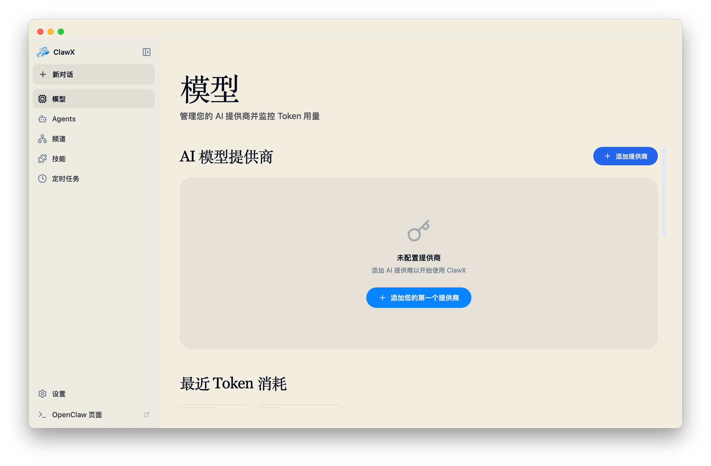
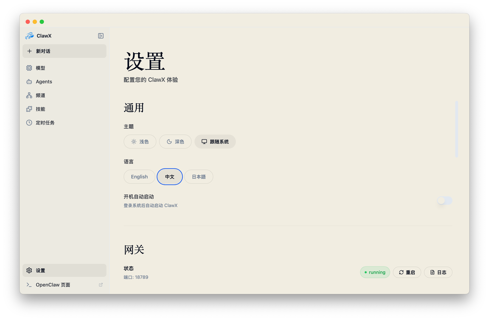

<p align="center">
  
</p>

<h1 align="center">BAIclaw</h1>

<p align="center">
  <strong>OpenClaw AI 智能體的桌面用戶端</strong>
</p>

<p align="center">
  <a href="#功能特色">功能特色</a> •
  <a href="#為什麼選擇-baiclaw">為什麼選擇 BAIclaw</a> •
  <a href="#快速開始">快速開始</a> •
  <a href="#系統架構">系統架構</a> •
  <a href="#開發指南">開發指南</a> •
  <a href="#參與貢獻">參與貢獻</a>
</p>

<p align="center">
  
  
  
  <a href="https://discord.com/invite/84Kex3GGAh" target="_blank">
  
  </a>
  
  
</p>

<p align="center">
  <a href="README.md">English</a> | <a href="README.zh-CN.md">简体中文</a> | 繁體中文
</p>

---

## 概述

**BAIclaw** 是連結強大 AI 智能體與一般使用者之間的橋樑。它建構在 [OpenClaw](https://github.com/OpenClaw) 之上，將原本偏向命令列操作的 AI 編排能力，整理成更直覺、可視化的桌面體驗。

不論你想要：

- 建立自動化工作流程
- 連接 Telegram、Discord、Lark 等訊息通道
- 管理技能、Agent 與排程任務
- 透過 BANK OF AI 模型能力進行聊天與任務執行

BAIclaw 都提供一致的圖形介面，讓你不用直接面對複雜的 CLI 細節。

目前產品預設以 **BANK OF AI** 作為聊天模型供應商，原生支援多語系、跨平台桌面環境，以及與 OpenClaw runtime 的整合。

---

## 畫面預覽

<p align="center">
  
</p>

<p align="center">
  
</p>

<p align="center">
  
</p>

<p align="center">
  
</p>

<p align="center">
  
</p>

<p align="center">
  
</p>

---

## 為什麼選擇 BAIclaw

打造 AI 智能體產品，不應該要求每一位使用者都先熟悉命令列。BAIclaw 的核心目標很直接：**保留 OpenClaw 的能力，同時提供更容易上手的桌面操作體驗。**

| 常見痛點 | BAIclaw 的做法 |
|----------|----------------|
| CLI 學習門檻高 | 提供完整桌面操作介面 |
| 供應商設定分散 | 統一整理成 BANK OF AI 帳號設定流程 |
| 聊天、技能、排程彼此割裂 | 用單一工作區整合 |
| 多語系體驗不足 | 內建英文、簡體中文、繁體中文、日文 |
| 更新與設定太偏工程導向 | 以一般產品 UI 的方式重新封裝 |

---

## 功能特色

### 💬 現代化聊天體驗

可直接與 AI 智能體互動，支援多對話、歷史紀錄、Markdown 內容顯示、附件上傳，以及直接在主輸入列中切換聊天目標。

### 🧠 BANK OF AI 模型整合

BAIclaw 目前以 BANK OF AI 為唯一可見的聊天模型供應商。新增帳號時只需填入 API Key，系統會將憑證安全保存，聊天區則可透過模型選擇器載入可用模型並直接切換。

### 🤖 Agent 管理

你可以建立、管理並設定不同 Agent，讓系統在不同工作情境中分工處理任務。

### 🔌 通道整合

可將 OpenClaw runtime 連接到 Telegram、Discord、Lark、WhatsApp 等通道，將智能體能力延伸到外部訊息平台。

### 🧩 技能系統

支援技能套件管理，方便將常用工具能力打包成可重複使用的工作模組。

### ⏰ 排程任務

可建立排程，讓指定 Agent 在預定時間自動執行任務。

### 🌐 多語系介面

目前內建：

- English
- 简体中文
- 繁體中文

### 🔐 安全的憑證儲存

Provider API Key 與 OAuth 類型的機密資訊會透過系統原生機制保存，不直接暴露在一般 UI 流程中。

### 🎨 自適應主題

支援淺色、深色與跟隨系統的主題模式。

---

## 快速開始

### 系統需求

- **作業系統**：macOS 11+、Windows 10+、Linux（Ubuntu 20.04+）
- **記憶體**：至少 4GB RAM，建議 8GB 以上
- **儲存空間**：至少 1GB 可用空間

### 安裝方式

#### 下載已編譯版本

可從 [Releases](https://github.com/ValueCell-ai/BAIclaw/releases) 下載各平台安裝包。

#### 從原始碼建置

```bash
git clone https://github.com/ValueCell-ai/BAIclaw.git
cd BAIclaw
pnpm run init
pnpm dev
```

### 首次啟動

第一次開啟 BAIclaw 時，設定精靈會引導你完成：

1. **語言與地區**：設定偏好的介面語系
2. **BANK OF AI 供應商**：新增 BANK OF AI 帳號並設為預設聊天供應商
3. **技能套件**：選擇常見情境的預設技能
4. **驗證流程**：確認基礎設定可正常運作

---

## BANK OF AI 使用方式

### 新增 BANK OF AI 帳號

前往 **模型** 頁面，新增供應商時只需要輸入 API Key。系統會使用預設的 BANK OF AI Base URL，並將憑證儲存在本機的安全儲存機制中。

### 聊天時切換模型

在聊天輸入列中，附件按鈕旁會顯示模型選擇 icon。點擊後可：

- 讀取 BANK OF AI `/models` 可用模型清單
- 顯示模型選單
- 直接切換目前預設聊天模型

模型切換後，BAIclaw 會同步更新 OpenClaw runtime 設定。

---

## 系統架構

BAIclaw 主要由三層組成：

1. **Renderer**
   React 19 + Vite + TypeScript，負責桌面 UI。

2. **Electron Main**
   負責系統能力、IPC、設定儲存、更新流程與各種 host API 代理。

3. **OpenClaw Runtime / Gateway**
   負責真正的聊天執行、Agent 運作、技能、通道與排程。

大致流程如下：

```text
Renderer UI
  -> host-api / api-client
  -> Electron Main
  -> OpenClaw Gateway / Local Config
  -> Provider / Channel / Skill Runtime
```

---

## 專案結構

```text
.
├── electron/               # Electron main / preload / backend services
├── resources/              # Icon、安裝素材、CLI 包裝檔
├── src/
│   ├── components/         # 共用 UI 元件
│   ├── pages/              # Chat / Models / Agents / Channels / Skills / Cron / Settings
│   ├── stores/             # Zustand 狀態管理
│   ├── lib/                # 前端 helper、api-client、brand、policy
│   ├── i18n/               # 多語系資源
│   └── styles/             # 全域樣式與設計 token
├── tests/                  # 單元測試
└── README*.md              # 多語系文件
```

---

## 開發指南

### 常用指令

| 工作項目 | 指令 |
|----------|------|
| 安裝依賴與下載 uv | `pnpm run init` |
| 啟動開發模式 | `pnpm dev` |
| 型別檢查 | `pnpm run typecheck` |
| 執行單元測試 | `pnpm test` |
| 建置前端 | `pnpm run build:vite` |
| 執行 lint | `pnpm run lint` |

### 開發注意事項

- 專案使用 `pnpm`，版本固定在 `package.json` 的 `packageManager`
- Renderer 不能直接呼叫 Gateway HTTP endpoint，需走 `host-api`
- 任何功能或架構修改後，應同步更新 README 與語系內容
- 本專案使用 `electron-store` 與系統 keychain，不需要額外資料庫

---

## 多語系文件

目前提供的 README：

- [English](/Users/jasonz/Documents/tron/ainft-baiclaw/README.md)
- [简体中文](/Users/jasonz/Documents/tron/ainft-baiclaw/README.zh-CN.md)
- [繁體中文](/Users/jasonz/Documents/tron/ainft-baiclaw/README.zh-TW.md)

---

## 參與貢獻

歡迎透過 Issue 或 Pull Request 參與 BAIclaw 的改進。若你要調整功能、修正錯誤或補充文件，建議先閱讀現有的程式結構與 README，再提交變更。

---

## 授權

本專案採用 [MIT License](LICENSE)。
